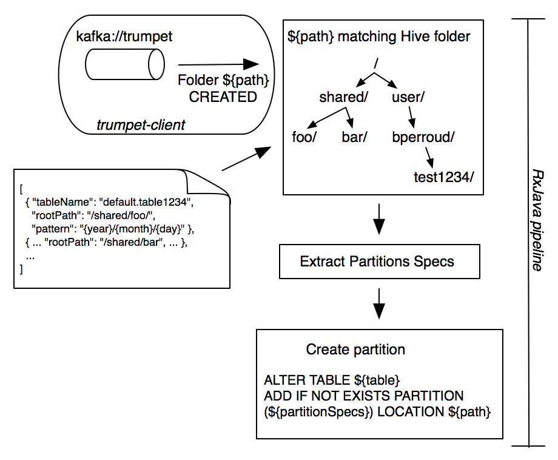

Hive Auto Partitioner
====

It's always boring to write the same code creating and maintaining Hive partitions in synch with the
underlying filesystem. This project aims at filling the gap and providing a primitive service
to create hive partitions.

# How it works

This project is leveraging [Trumpet](https://github.com/verisign/trumpet), a sort of
[iNotify](https://en.wikipedia.org/wiki/Inotify) for HDFS, to avoid polling the NameNode but get informed about
directory structure change, i.e. when a new partition is created.

The configuration will specify parent folders into which data will be stored in the right partition.
Partition is provided via an expression, like `{year}/{month}/{day}`, from which the name of the paritition
can be extracted and passed to Hive.

Say the parent folder is `/user/bperroud/myhivefolder/`, and my partition expression is `{year}/{month}/{day}`.
When a new folder `/user/bperroud/myhivefolder/2016/01/18` is created, I can extract `year = 2016`, `month = 01`
and `day = 18` out of this folder, and trigger the following DDL:
`ALTER bperroud.my_hive_table ADD PARTITION (year = '2016', month = '01', day = '18') LOCATION '/user/bperroud/myhivefolder/2016/01/18'`.

The configuration file is reflecting these attributes the following:

```
  {
    "tableName": "bperroud.my_hive_table",
    "parentPath": "/user/bperroud/myhivefolder/",
    "pattern": "{year}/{month}/{day}"
  }
```

Once loaded, this configuration piece will keep your table partitions in synch!

The flow diagram below illustrate the interaction between components.



# Limitations

## Partitions separation

Hive Auto Partition expect the partitions to be separated, preferably by a `/`, but not necessarily.
For instance, `{year}/{month}/{day}` partitioning is good, while `{year}{month}{day}` can't
be handled. `year={year},month={month},day={day}` would also work, too, but separation
in sub-folders is strongly encouraged.

## Partitions deletion pattern

The partition deletion works only if the delete is made on the top level, i.e. if the folder
and partitions is `/a/c/b/2016/03/03`, if `/a/c/b/2016` is deleted, the partitions will not
be deleted. The (heavy) `partitions-synch.sh` script has to be launched to
re-synchronize the partitions.

# How to use it

This project is based on [Maven](http://maven.apache.org), and build a RPM for easy installation. We also provide an
example [Supervisord](http://supervisord.org/) [configuration file](src/main/config/hive-auto-partitioner.ini)
for running Hive Auto Partitioner as a daemon.

## Build it

To build it, you need to ensure you have java and maven properly installed, and then: 

Before building the project, you need to build Trumpet dependency.

```
git clone git@github.com:verisign/trumpet.git
cd trumpet
mvn clean install -Phdp234 -DskipTests
```

Once this is complete, you can build this project:

```
mvn clean install
```

And you can directly import the project in most of the IDE, too.


## Run it

Once the project is built, a RPM is available for easy deployment.

Install the RPM:

```
rpm -ivh target/rpm/hive-auto-partitioner-el6.x86_64/RPMS/x86_64/hive-auto-partitioner-*.x86_64.rpm
```

We do provide a [startup shell script](src/main/scritps/run.sh) for starting the process. Once installed,
the script is avaible here `/opt/daplab/hive-auto-partitioner/bin/run.sh`. The script is `--help` friendly,
so feel free to abuse from the help.

An example [Supervisord](http://supervisord.org/) [configuration file](src/main/config/hive-auto-partitioner.ini)
is provided for convenience:

Copy the supervisord config file in the supervisor folder, usually `/etc/supervisor.d/` or similar.

Then add `hive-auto-partitioner` process to Supervisor:

```
supervisorctl reread
supervisorctl add hive-auto-partitioner
```

And simply start it

```
supervisorctl start hive-auto-partitioner
```

Hive-auto-partitioner will start loogging into  `/opt/daplab/hive-auto-partitioner/logs/`


## Test it

In Hive, create a partitioned table:

```
create table `default`.`test123` (
  col1              string,
  col2              int
)
partitioned by (p1 string, p2 string) LOCATION '/tmp/test123/';
```

Then, configure Hive-auto-partitioner to monitor `/tmp/test123/` folder. Edit the configuration file
`/opt/daplab/hive-auto-partitioner/config/hive-partitions.json`, and add the following definition.
Please respect JSON formatting, i.e. you might add an extra trailing `,` in the line just above.

```
 {
    "tableName": "default.test123",
    "parentPath": "/tmp/test123/",
    "pattern": "{p1}/{p2}"
  }
```

Create a new folder in HDFS in the parent folder:

```
hdfs dfs -mkdir -p /tmp/test123/value-for-p1/another-value-for-p2/
```

This will create a partition `(p1 = value-for-p1, p2 = 'another-value-for-p2')`. That's as easy as that!

### Partition by `year`, `month`, `day`

```
create table `default`.`test456` (
  col1              string,
  col2              int
)
partitioned by (year int, month int, day int) LOCATION '/tmp/test456/';

ALTER TABLE `default`.`test123` ADD PARTITION (`month`='03',`year`='2016',`day`='03') LOCATION '/tmp/test456/2016/03/03';
```

Mind that with `hive.assume-canonical-partition-keys` turned on, the partition will strip leading `0`
and become `year=2016/month=3/day=3`.

# Synchronization or Reconciliation of _older_ tables

A powerful but yet heavy tool is available to create new partitions and purge old ones in one go, 
because if hive-auto-partitioner is setup on a folder with already existing sub-folders,
only partition on the *new* folders will be created, not on the existing one.
A tool to create partitions on existing folders is thus provided to fill up the gap:

```
sudo -u hdfs /opt/daplab/hive-auto-partitioner/bin/partitions-synch.sh \
  --configFile /opt/daplab/hive-auto-partitioner/config/hive-partitions.json
```

## Options

The aforementioned script is `--help` friendly, please refer to the help to get all the possible
options.

# Contributing to Hive-Auto-Partitioner <a id="Contributing"></a>

Code contributions, bug reports, feature requests etc. are all welcome.

If you are new to GitHub please read [Contributing to a project](https://help.github.com/articles/fork-a-repo) 
for how to send patches and pull requests to hive-auto-partitioner.

And if you find cool writing such piece of software, join us every Thursday evening for our weekly [Hacky Thursdays](http://daplab.ch/#hacky)!


# TODO

* Delayed partition creation: sometime it would be better to create the partition when
  all the data is stored in the folder, and not at the first file creation like
  it is the case as of today. This would be translated, for instance,
  in waiting for a `_SUCCESS` file and creating the partition at that time.
